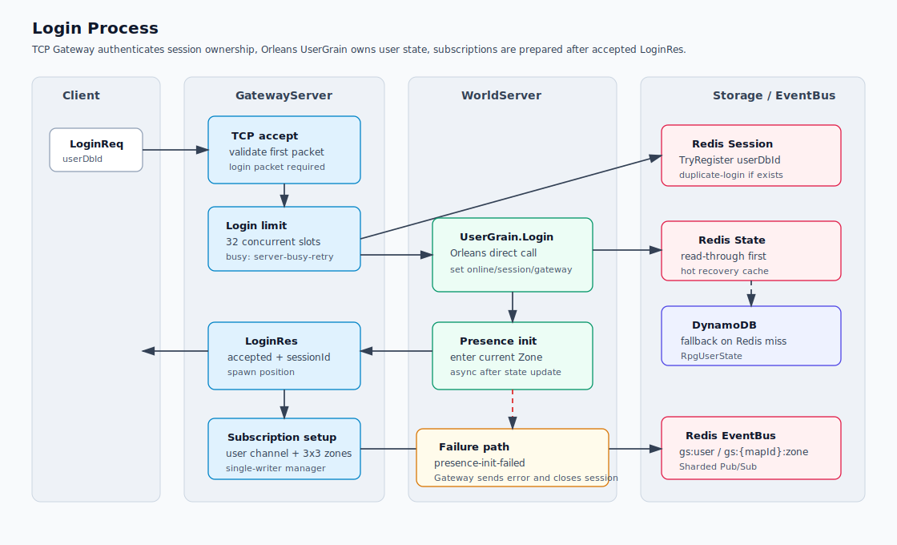
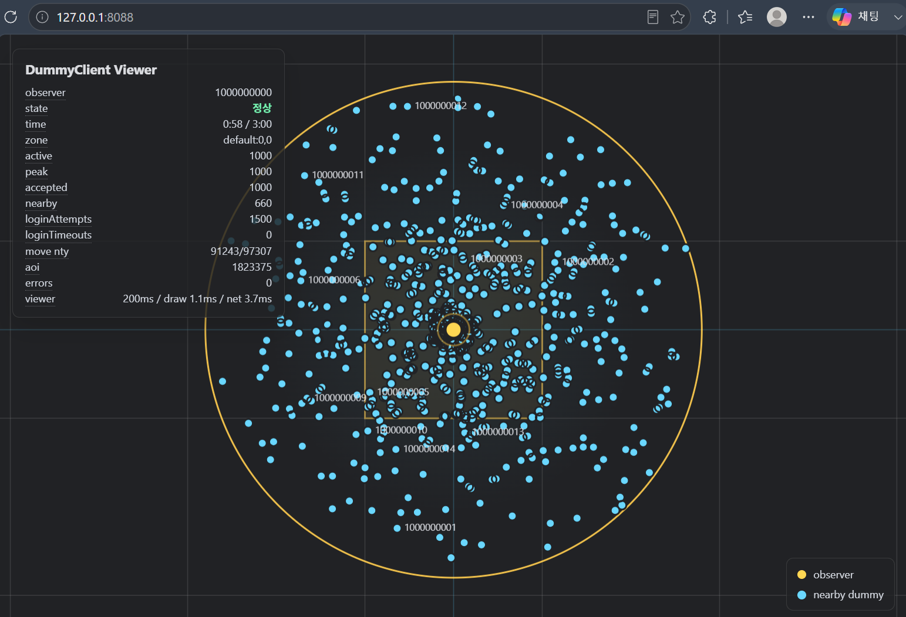

# rpgServer


<br>

## 개요

`rpgServer`는 C# .NET 10, Orleans, Redis, DynamoDB Local, Aspire 기반의 MMORPG 서버 프로토타입입니다.

현재 구현은 좁은 지역에 많은 더미를 몰아넣고 이동 패킷으로 큰 부하를 주는데 초점을 맞췄습니다.

<br>

## Orleans을 사용한 이유

MMORPG는 게임이라는 분야에서 종합 선물 세트와 같은 장르입니다. 때문에 수많은 유저들이 함께 모이는 환경 속에서 다양한 컨텐츠를 제공해야만 했고 고성능을 위해 개발자가 분산 처리에 대해 끝없이 고민해야 하는 이유가 되었습니다.

이러한 환경 속에서 나날이 복잡해지는 구조를 완화하기 위해 과거 Lock-Free를 위한 Serializer를 도입 하기 시작했고 오딘에 이르러 서버의 핵심으로 도입되기에 이르렀습니다.

Orleans의 가상 액터 모델은 직렬화를 프레임워크에서 지원하고 있으며 분산 처리에 대한 해법을 제시해주는데 특화되어 오늘날의 MMORPG에 적합하다고 생각했습니다.

`User`처럼 명확한 소유자가 있는 상태를 Grain이라는 가상 액터 안에서 하나의 스레드로 순차 처리하게 해주기 때문에, 세션 갱신, 이동, 로그아웃, 저장 예약 같은 유저 단위 상태 변경을 명확하게 만들 수 있습니다.

이 프로젝트에서는 GatewayServer가 Orleans Client로 `UserGrain`을 직접 호출하고, WorldServer는 Orleans Silo로 동작합니다. 

또한 로컬에서도 WorldServer 2개 구성을 검증하며, 유저의 상태는 Grain 메모리를 기준으로 Redis/DynamoDB 로 구성된 Write-behind 경로에 연결합니다.

결과적으로 Orleans는 이 프로젝트에서 다음 의도를 위해 사용했습니다.

- 유저 단위 상태 소유권을 `UserGrain`에 고정해 동시성 범위를 줄임
- 본격적인 맵 구성에 앞서 `ZoneGrain`을 통해 Zone별 객체 목록과 Area of Interest(AOI)를 활용해 위치 변화의 처리를 분리
- Gateway scale-out 상태에서도 서버 간 직접 객체 참조 대신 Grain Id에 기반한 호출 유지
- Grain 활성화/비활성화 시점에 Redis/DynamoDB의 복구와 flush 정책을 붙이기 쉬움
- actor 단위로 콘텐츠 로직을 추가할 수 있어 이후 전투, 인벤토리, 파티, 길드 기능으로 확장 가능

<br>

## 현재 구조

```text
DummyClient
  -> TCP
GatewayServer x3
  -> Orleans Client direct call
WorldServer x2, Orleans Silo
  -> Orleans Grain memory
  -> Redis storage/cache
  -> DynamoDB Local write-behind

WorldServer
  -> Redis EventBus, Sharded Pub/Sub
GatewayServer x3
  -> TCP
DummyClient
```

Aspire는 LLM과 클라우드 환경에 대비한 테스트 프레임워크로 로컬에서 다음 리소스를 함께 실행합니다.

- `redis`: Orleans clustering, 세션 상태, 저장 캐시
- `redis-eventbus`: WorldServer에서 GatewayServer로 전달되는 event fan-out
- `dynamodb-local`: 로컬 영속 저장소
- `worldserver-1`, `worldserver-2`
- `gatewayserver-1`, `gatewayserver-2`, `gatewayserver-3`

<br>

## Solution 구성

| 프로젝트 | 역할 |
| --- | --- |
| `GameServer.AppHost` | Redis 2개, DynamoDB Local, Gateway 3개, World 2개 로컬 오케스트레이션 |
| `GameServer.ServiceDefaults` | Aspire 공통 설정, health check, OpenTelemetry |
| `Shared` | Grain contract, 월드 DTO, EventBus 채널, Protobuf |
| `WorldServer` | Orleans Silo, User/Zone Grain, 유저 상태 write-behind 저장, AOI delta |
| `GatewayServer` | TCP 연결, 로그인 제한, 세션 관리, Orleans Client 호출, Redis EventBus 수신, AOI 필터링 |
| `DummyClient` | 로그인/이동/AOI 부하 테스트와 Canvas viewer |

<br>

## Gateway와 EventBus

Gateway에서 WorldServer로 가는 명령은 Orleans Client가 `UserGrain`을 직접 호출합니다. WorldServer에서 Gateway로 돌아오는 AOI/개인/브로드캐스트 이벤트는 별도 Redis EventBus의 Sharded Pub/Sub를 사용합니다.

| 채널 | 용도 |
| --- | --- |
| `gs:broadcast:gateway:{gatewayId}` | 특정 Gateway에 붙은 세션 대상 서버 알림 |
| `gs:user:{userDbId}` | 로그인 성공 후 구독하는 개인 저빈도 이벤트, reconnect reliable event |
| `gs:{mapId}:zone:{cellX}:{cellY}` | Zone 단위 AOI delta fan-out |

Gateway 생존 상태는 heartbeat key로 관리합니다. 기본값은 1초 갱신, 3초 TTL입니다.

Gateway 내부의 user/zone 구독 ref count와 `zone -> session` 인덱스는 single-writer queue를 사용하는 `GatewaySubscriptionManager`가 순서대로 갱신합니다.

Zone 이벤트는 `ServerDeliveryPolicy`에 따라 처리 경로가 나뉩니다. `Reliable` 이벤트는 누락 없이 전달하고, `LatestPerEntity` 이벤트는 Gateway의 Zone hash partition에서 최신값으로 병합한 뒤 session hash partition에서 관찰자와 객체 기준으로 다시 병합해 tick 단위로 전송합니다.

현재 남아있는 가장 강한 병목은 `GatewayAoiAggregator`의 session AOI command queue입니다.

이 단계에서 Zone AOI가 관찰자 세션별 필터링 작업으로 fan-out되기 때문에, 좁은 지역에 많은 유저가 몰리면 queue 지연이 가장 먼저 커집니다. 현재 로컬 기본값은 `SessionAoiPartitionCount=16`으로 두어 병렬성을 확보하지만, 
후술할 1000명 테스트에서 단일 PC를 사용할 경우 순간적으로 큰 지연이 발생합니다. 따라서 프로덕션까지 가기 위해서 개선해야할 부분입니다.

<br>

## 주요 설정 옵션

`GatewayServer/appsettings.json`의 `Gateway` 섹션은 `GatewayOptions`와 맞춰 관리합니다.

| 옵션 | 기본값 | 설명 |
| --- | ---: | --- |
| `MaxConcurrentLogins` | 16 | Gateway 인스턴스별 동시 로그인 처리 수 |
| `SessionTTLSec` | 30 | Redis 세션 TTL |
| `SessionRefreshIntervalSec` | 10 | 접속 유지 중 세션 TTL 갱신 주기 |
| `GatewayHeartbeatIntervalSec` | 1 | Gateway live key 갱신 주기 |
| `GatewayHeartbeatTTLSec` | 3 | 죽은 Gateway 판정 TTL |
| `EventQueueCapacity` | 4096 | Redis EventBus 수신 큐 용량 |
| `EventQueueWorkerCount` | 4 | Gateway 이벤트 큐 worker 수 |
| `LatestEventTickMs` | 100 | latest-only 이벤트 병합 및 전송 기준 tick |
| `LatestEventQueueCapacity` | 4096 | Gateway가 보관할 latest-only Zone 버퍼 최대 수 |
| `LatestEventPartitionCount` | 4 | latest-only Zone 이벤트 hash partition 수 |
| `LatestEventProcessingBudgetMs` | 100 | Gateway 전체 latest-only Zone tick 처리 시간 예산. Zone partition 수로 나눠 적용 |
| `SessionAoiPartitionCount` | 16 | 세션별 AOI 병합/전송 hash partition 수 |
| `SessionAoiTickMs` | 100 | 세션별 pending AOI 전송 tick |
| `SessionAoiQueueCapacity` | 4096 | 세션 AOI partition별 입력 큐 용량 |
| `SessionAoiSendConcurrency` | 32 | latest-only AOI 전송 동시 실행 제한 |
| `AoiEnterRadiusMeters` | 70 | AOI에 새로 진입한 것으로 판단하는 반경 |
| `AoiExitRadiusMeters` | 80 | 이미 보이던 엔티티를 AOI에서 제거하는 반경 |

`WorldServer/appsettings.json`의 `WorldStorage` 섹션은 write-behind 저장 동작을 관리합니다.

| 옵션 | 기본값 | 설명 |
| --- | ---: | --- |
| `DirtyScanIntervalSec` | 1 | dirty set 스캔 주기 |
| `UserDefaultSaveIntervalSec` | 5 | 일반 유저 상태 저장 기준 주기 |
| `UserLowPrioritySaveIntervalSec` | 30 | 이동 위치 등 낮은 중요도 상태 저장 기준 주기 |
| `CriticalStateFlushDelaySec` | 1 | 아이템/재화 등 중요 상태 flush 지연 |
| `FlushBatchSize` | 250 | dirty state 1회 처리 최대 개수 |
| `DeactivateRedisTTLSec` | 300 | Grain 비활성화 후 Redis state TTL |
| `DynamoDbReadTimeoutSec` | 5 | DynamoDB 복구 read timeout |

`WorldStorage:DynamoDb` 하위 설정은 DynamoDB 접속 정보, 테이블 이름, 로컬 생성 여부만 관리합니다. 실제 테이블 스키마는 `Dynamodb/Tables/*.json`에 AWS CLI `create-table --cli-input-json`에 가까운 형태로 둡니다.

| 옵션 | 기본값 | 설명 |
| --- | --- | --- |
| `UserStateTableName` | `RpgUserState` | 유저 기본 상태 테이블 이름 |
| `UserInventoryTableName` | `RpgUserInventory` | 유저 인벤토리 테이블 이름 |
| `UserCurrencyTableName` | `RpgUserCurrency` | 유저 재화 테이블 이름 |
| `CreateLocalTablesIfNotExists` | `false` | 로컬 개발 환경에서만 없는 테이블을 JSON 정의로 생성 |
| `LocalTableDefinitionDirectory` | `Dynamodb/Tables` | 로컬 테이블 정의 JSON 경로 |

로컬 단독 실행용 `appsettings.Development.json`에는 `redis`와 `eventbus` 연결 문자열을 분리해서 둡니다. Aspire 실행 시에는 AppHost가 각 프로세스에 동일한 값을 환경변수로 주입합니다.

<br>

## 로그인과 이동



- Gateway 하나마다 TCP 접속을 받고 동시 로그인 처리 수를 기본 16개로 제한합니다.
- 초과 요청은 `ErrorCode.LoginServerBusyRetry`로 거절되며 DummyClient는 재시도합니다.
- `LoginReq`는 `user_db_id`를 전달하고, Gateway는 `UserDbId` 기준으로 `UserGrain.LoginAsync`를 직접 호출한 뒤 `LoginRes`를 즉시 TCP로 반환합니다.
- 로그인 성공 후 Zone 입장 초기화는 WorldServer에서 비동기로 진행합니다. 실패하면 로그를 남기고 Gateway broadcast 채널로 `ErrorCode.LoginPresenceInitFailed`를 보내 해당 세션을 서버 측에서 닫습니다.
- 이동 요청은 Gateway에서 200ms 단위로 세션별 최신 요청만 남긴 뒤 `UserGrain.MoveAsync`로 전달됩니다.
- `UserGrain.MoveAsync`는 유저 단위 개인 이동 검증을 수행합니다. 좌표 유효성, map 일치, 속도 제한을 확인하고 허용 거리를 초과한 요청은 서버 위치로 보정합니다.
- `MoveNty`는 Gateway가 `MoveAsync` 결과로 직접 TCP client에 전달합니다.

<br>

## AOI와 Zone

- Zone 크기는 50m x 50m입니다.
- Gateway는 유저 위치 기준 현재 Zone과 주변 5x5 Zone을 구독합니다.
- Zone 5x5는 후보 수집 범위이며, 실제 전송은 서버 확정 위치 기준 시야 반경 안의 엔티티만 포함합니다. 기본값은 진입 70m, 이탈 80m입니다.
- `ZoneGrain`은 객체 목록 관리와 AOI delta 발행만 담당하며, 이동 권한 검증은 `UserGrain`에서 처리합니다.
- Gateway는 Zone delta를 세션별로 필터링하고 `LatestPerEntity` 정책 이벤트는 Zone hash partition에서 200ms 단위로, session hash partition에서 기본 100ms 단위로 묶어서 전송합니다.
- `Reliable` 정책은 입장, 퇴장, 에러, 보상처럼 누락되면 안 되는 이벤트에 사용합니다.
- `LatestPerEntity` 정책은 이동, 전투 상태 스냅샷처럼 중간 delta 손실이 허용되는 이벤트에 사용합니다. 같은 observer tick 안에서는 entity별 upsert를 최신값으로 덮어써 전송하며, 중간 경로보다 최신 상태 수렴을 우선합니다.
- Zone 이동은 객체 제거가 아니므로 `AoiDelta.Removes`를 발행하지 않습니다. 실제 로그아웃/소멸만 reliable remove로 전달하고, Zone 이동은 latest-only 이동 AOI로 수렴시킵니다.
- Viewer는 첫 번째 로그인 성공 유저를 관찰자를 사용하며 주변 유저와 Zone grid를 Canvas로 표시합니다.

<br>

## 저장 구조

유저 상태 저장을 기준으로 Grain Memory, Redis, DynamoDB Local의 3단계에 걸친 write-behind 구조입니다.

```text
Grain memory
  -> Redis
  -> DynamoDB Local, Dirty를 사용한 Flush
```

저장 중요도는 3단계입니다.

| 단계 | 기준 주기 | 대상 예시 |
| --- | ---: | --- |
| Critical | 1초 | 유저 소유 아이템, 재화, reconnect reliable event ack |
| Default | 5초 | 로그인/온라인 상태, 기본 유저 상태 |
| Low priority | 30초 | 이동 위치 등 유실 비용이 낮은 상태 |

UserGrain 활성화 시 Redis를 먼저 조회하고 miss일 때 DynamoDB에서 로드합니다.  
UserGrain 비활성화 시 DynamoDB에 즉시 반영하고 Redis Key에는 5분 TTL을 부여합니다.

DynamoDB는 저장 성격별 테이블을 사용합니다.  
현재 UserState만 실제 write-behind 경로에서 사용하며, Inventory/Currency는 이후 유저 소유 아이템과 재화 분리를 위한 테이블입니다.  
각 item은 `Kind`, `Payload`, `ETag`를 저장하고 `UpdatedAtUnixMs` 컬럼은 사용하지 않습니다.

로컬 개발에서 필요한 DynamoDB 테이블은 `Dynamodb/Tables/*.json` 정의로 생성합니다. 기존 테이블이 있으면 구조를 자동 변경하지 않으며, 스테이징/운영에서는 별도 IaC나 배포 파이프라인이 테이블 생성을 담당하는 전제를 둡니다.

| 테이블 | 용도 |
| --- | --- |
| `RpgUserState` | 유저 기본 상태, `PK = userDbId` |
| `RpgUserInventory` | 유저 소유 아이템, `PK = userDbId`, `SK = itemDbId` |
| `RpgUserCurrency` | 유저 재화, `PK = userDbId` |

Monster와 DropItem은 Zone에 종속된 휘발성 객체로 보고 별도 Grain이나 Redis/DynamoDB 저장 대상으로 만들지 않습니다. 추후 구현 시 `ZoneGrain`이 소유하는 런타임 엔티티로 관리하고, 영속성이 필요한 아이템 원본 정보만 별도 Item 저장 모델로 분리합니다.

<br>

## TCP 패킷

Client와 Gateway는 4 byte big-endian length prefix와 Protobuf payload로 통신합니다. 

유저, 몬스터, 드랍 아이템, 아이템 식별자는 서버 내부와 패킷에서 `int64` 기반 ID를 사용합니다. DummyClient는 계정 서버 없이 `--base-user-db-id + index` 방식으로 테스트용 `UserDbId`를 생성합니다.

- `ClientReq.proto`: Client -> Server 요청
- `ServerRes.proto`: Server -> Client 응답/알림
- `PacketStruct.proto`: 공통 구조체

주요 client packet은 `LoginReq`, `MoveReq`, `LogoutReq`, `AckReq`입니다. 주요 server packet은 `LoginRes`, `MoveNty`, `AoiDelta`, `ReliableEvent`, `ErrorRes`입니다.

서버 이벤트는 `ServerResEnvelope.delivery_policy`로 Gateway 전달 정책을 함께 보냅니다. 기본값은 `Reliable`이며, 이동 AOI처럼 최신값만 의미 있는 이벤트는 `LatestPerEntity`를 사용합니다.

에러 사유는 `PacketStruct.proto`의 공통 `ErrorCode` enum을 사용합니다. `LoginRes`, `MoveNty`, `ErrorRes` 모두 같은 enum을 사용하므로 클라이언트는 문자열 파싱 없이 코드 기준으로 분기할 수 있습니다.

<br>

## 실행

#### 요구 사항:
*  [.NET SDK 10](https://dotnet.microsoft.com/ko-kr/download/dotnet/10.0)
*  OS에 맞는 Docker 호환 런타임

#### 로컬 서버 빌드 및 실행:

Visual Studio 2026에서 ``F5``

or

```powershell
dotnet run --project GameServer\GameServer.AppHost\GameServer.AppHost.csproj
```

#### 잔여 테스트 리소스 정리 
Redis, Redis EventBus, DynamoDB Local 컨테이너는 Aspire 세션으로 실행됩니다. AppHost를 정상 종료하면 함께 정리되지만, 테스트 중 프로세스를 강제 종료했거나 컨테이너가 남아있으면 다음 명령으로 테스트 리소스를 정리합니다.

```powershell
.\Scripts\cleanup-local-test.ps1
```

#### 로컬 엔드포인트 구성 :

- Gateway TCP: `localhost:7777`, `localhost:7778`, `localhost:7779`
- Gateway HTTP: `http://127.0.0.1:5031`, `http://127.0.0.1:5032`, `http://127.0.0.1:5033`
- Redis: `localhost:6379`
- Redis EventBus: `localhost:6380`
- DynamoDB Local: `http://localhost:8000`

<br>

## DummyClient 테스트
먼저 서버를 실행 합니다. 그런 다음 아래 명령을 사용해주세요.

간단한 15초 테스트:

```powershell
dotnet run --project GameServer\DummyClient\DummyClient.csproj -- --clients 100 --base-user-db-id 1000000000 --gateways localhost:7777,localhost:7778,localhost:7779 --duration 00:00:15
```

1000명 3분간 테스트:

```powershell
dotnet run --project GameServer\DummyClient\DummyClient.csproj -- --clients 1000 --base-user-db-id 1000000000 --gateways localhost:7777,localhost:7778,localhost:7779 --duration 00:03:00 --viewer-port 8088
```

`--viewer-port`를 지정하면 브라우저에서 `http://localhost:8088`을 열면 관찰자로 선정된 유저의 주변을 Canvas로 확인할 수 있습니다.

DummyClient는 로그인 시작 전 지정한 Gateway TCP endpoint가 열릴 때까지 최대 30초 대기하며 `--gateway-ready-timeout`으로 조정할 수 있습니다.  

기본적으로 5초마다 100명씩 로그인 시도를 시작합니다. Viewer 시야 반경은 70m이고, 상태 snapshot은 기본 100ms마다 갱신합니다.  
이동 요청은 클라이언트별로 100ms~500ms 랜덤 간격으로 전송되며, 이동량은 `6m/s * 실제 경과 시간`으로 계산합니다.  
이동 방향은 70% 확률로 유지하고, 변경 시에는 현재 방향에서 최대 120도만 회전합니다.
DummyClient는 서버가 보낸 `MoveNty.AuthoritativePosition`을 다음 이동 기준 위치로 반영하며, 이동 거절은 `MoveRejected` 지표로 집계합니다.

 

## TODO
- 기획 데이터 로더  
- 로그 시스템  
- 기본적인 아이템 처리
- 지형/충돌 기반 이동 검증 확장
